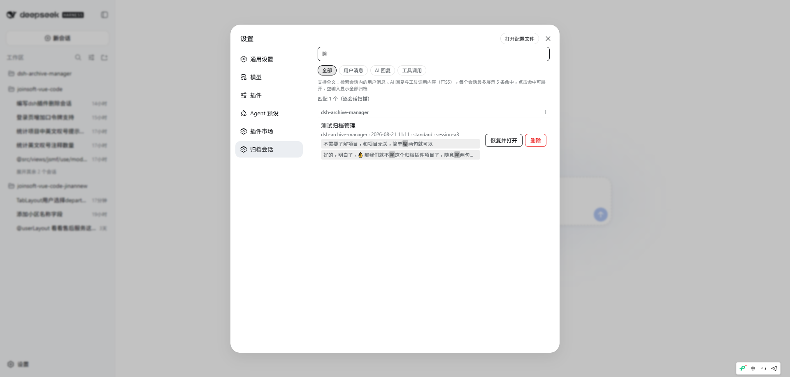

# dsh-archive-manager

<div align="center">

English · [中文](./README.md)

[](https://www.npmjs.com/package/@chushiz/dsh-archive-manager)
[](https://github.com/deepseek-ai/deepseek-harness)
[](./LICENSE)

</div>

A DeepSeek Harness Web GUI plugin for managing **archived** sessions, under **Settings > 归档会话**. The harness's built-in "archive" is one-way: it only hides a session, with no un-archive. This plugin adds browse, restore, and true delete:

- **Browse** — archived sessions grouped by workspace, searchable by title / cwd / id / preset / **full-text content**.
- **Full-text search** — powered by the harness's `sessionQuery` SQLite FTS5 index: user messages, assistant replies, tool calls & arguments, and todos are all searchable; hits show a context snippet, with automatic per-session scan fallback when no FTS backend exists.
- **Restore & open** — un-archive and open, so you can view history and continue the conversation.
- **Delete** — physically removes the session's log directory. **Irreversible.**



```
host:   archive set + persisted title/metadata  --archiveManager service--> browser
client: Settings page "归档会话" (workspace groups + full-text search + restore & open + delete)
```

## Install

```sh
dsh plugin --profile web add @chushiz/dsh-archive-manager
```

Restart `dsh web` after install, then find it under **Settings > 归档会话**.

## Compatibility

| dsh version | status |
| --- | --- |
| `>= 0.1.0-rc.7` | ✅ supported (FTS5 search + direct service wiring) |
| `< 0.1.0-rc.7` | ⚠️ unverified (needs `sessionQuery.searchSessions` and the `webServer` carrier) |

- Node.js `^22.19 || >=24` (same as dsh)
- Falls back to per-session scanning without an FTS backend (`openAt: never`); falls back to HTTP API when the service is not proxied to the browser

## Permission boundary

- The **host** half reads/writes the workspace registry's **archive set** and **persistence** state: `list` is read-only, `unarchive` reverses an archive, `delete` removes the log directory via a shell command. It never writes logs and registers no model-facing tools.
- The **client** half registers the `settings.section` page and calls the `archiveManager` service.

## License

MIT
